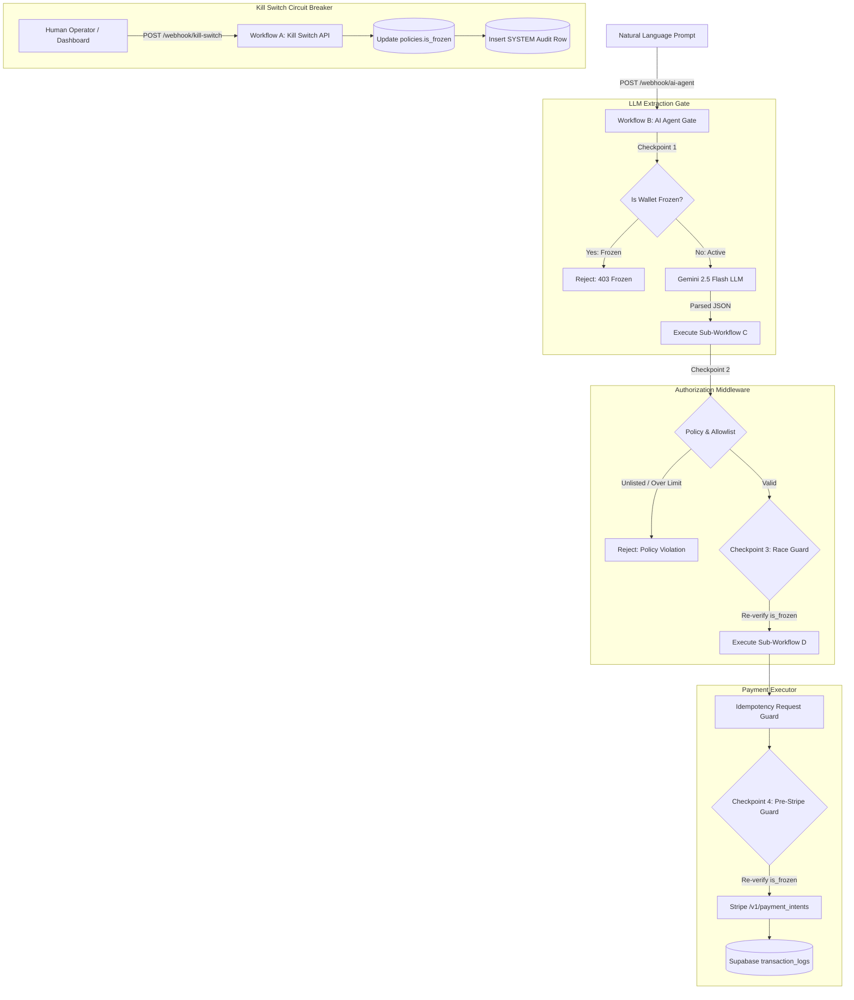

# 🛡️ THE KILL SWITCH — Independent AI Wallet Authorization Middleware

> **Zero-Trust Security, Multi-Stage Enforced Checkpoints, and Emergency Circuit Breakers for Autonomous Agentic Financial Transactions.**

[](https://opensource.org/licenses/MIT)
[](https://github.com/Abhijit5011/kill-switch)
[](https://n8n.io)
[](https://supabase.com)
[](https://stripe.com)

---

## 📖 Executive Summary

**The Kill Switch** is a zero-trust financial security middleware designed to enforce strict, auditable guardrails on autonomous AI payment agents. As AI agents gain autonomy to invoke APIs, execute contracts, and purchase goods, they introduce significant risks of financial loss due to prompt injection, hallucinated payment parameters, unlisted counterparties, or budget overflows.

**The Kill Switch** sits directly between the untrusted AI agent and payment rails (such as Stripe). It decouples LLM interpretation from financial execution, ensuring that **no AI agent ever possesses direct access to database credentials or Stripe API keys**. Every payment request passes through a 4-checkpoint security evaluation pipeline in **n8n**, backed by Supabase Postgres and a 3D physical Emergency Kill Switch capable of halting all autonomous transactions in under 50 milliseconds.

---

## 🎯 Problem Statement & Zero-Trust Solution

### The Problem
- **Direct Agent Exposure:** Giving an LLM direct access to payment APIs allows prompt injection attacks to drain corporate wallets.
- **Race Conditions:** Simultaneous agent requests can exceed daily caps if limits are checked once at the start of a request.
- **Lack of Accountability:** Machine-driven transactions lack human-auditable operator logs when emergency stops occur.

### The Zero-Trust Solution
- **Decoupled Architecture (ADR-001):** The AI Agent workflow interprets natural language into structured JSON, but possesses **zero database write permissions** and **zero Stripe API access**.
- **Sole Middleware Authority (ADR-002):** Authorization logic is completely isolated inside an immutable middleware workflow (**Workflow C**).
- **Atomic Pre-Execution Race Guard (ADR-003):** Policies are re-evaluated immediately before Stripe API calls are initiated (**Checkpoint 3 & Checkpoint 4**).
- **Auditable System Control (ADR-004):** Emergency stops require named operator signatures, recorded immutably in Supabase audit logs.

---

## 🏗️ End-to-End System Architecture



---

## 🏛️ Architectural Decision Records (ADRs)

| ADR ID | Title | Principle & Implementation |
| :--- | :--- | :--- |
| **ADR-001** | LLM Credential Isolation | Gemini 2.5 Flash key ONLY in Workflow B. 0 DB write permissions, 0 Stripe access. |
| **ADR-002** | Middleware Sole Authority | Workflow C holds Supabase Service Role key. Re-verifies all policies independently of LLM claims. |
| **ADR-003** | Multi-Stage Race Guard | Checkpoint 3 re-reads `policies.is_frozen` immediately prior to handing off to the payment executor. |
| **ADR-004** | Auditable Operator Actions | Kill switch activation requires explicit operator identification logged in Supabase `transaction_logs`. |
| **ADR-005** | Stripe Idempotency | Payment requests pass `request_id` header to Stripe `/v1/payment_intents` to prevent duplicate charges. |

---

## ⚙️ n8n Multi-Workflow Microservices Topology

The backend architecture consists of 4 decoupled n8n workflows (`n8n-workflows/*.json`):

### 1. Workflow A — Kill Switch API (`workflow-a-kill-switch-api.json`)
- **Trigger:** Public Webhook `POST https://abhijitdeshmukh.app.n8n.cloud/webhook/kill-switch`
- **Credential Scope:** Supabase Service Role Key ONLY
- **Responsibility:** Instantly mutates `policies.is_frozen` in Postgres (`true`/`false`) and appends an auditable `SYSTEM` transaction log row with the operator's name.

### 2. Workflow B — AI Agent Gate (`workflow-b-ai-agent.json`)
- **Trigger:** Public Webhook `POST https://abhijitdeshmukh.app.n8n.cloud/webhook/ai-agent`
- **Credential Scope:** Gemini API Key ONLY
- **Enforced Checkpoint:** **Checkpoint 1** (Fails fast if `policies.is_frozen === true` before calling Gemini).
- **Responsibility:** Converts prompt text into structured JSON (`{ recipient, amount }`). Invokes Workflow C internally.

### 3. Workflow C — Authorization Middleware (`workflow-c-authorization-middleware.json`)
- **Trigger:** Internal `Execute Workflow Trigger` (Called by Workflow B)
- **Credential Scope:** Supabase Service Role Key ONLY (Cannot call Stripe)
- **Enforced Checkpoints:** **Checkpoint 2** (Allowlist verification & daily spend cap validation) & **Checkpoint 3** (Pre-executor race guard).
- **Responsibility:** Validates counterparty against pre-approved allowlist and enforces `spent_today + amount <= daily_limit`.

### 4. Workflow D — Payment Executor (`workflow-d-payment-executor.json`)
- **Trigger:** Internal `Execute Workflow Trigger` (Called by Workflow C)
- **Credential Scope:** Stripe Test Secret Key + Supabase Service Role Key
- **Enforced Checkpoint:** **Checkpoint 4** (Final pre-Stripe execution guard).
- **Responsibility:** Executes `/v1/payment_intents` on Stripe Test Rails and logs `APPROVED`/`EXECUTED`/`FAILED` transaction rows in Supabase.

---

## 🛡️ Security Checkpoint Evaluation Flow

```
[Incoming Prompt Request]
          │
          ▼
    ┌───────────┐     IS FROZEN? = YES
    │CHECKPOINT1├──────────────────────────► [HALT: 403 Wallet Frozen (Skip LLM)]
    └─────┬─────┘
          │ NO
          ▼
    ┌───────────┐     UNLISTED / OVER LIMIT? = YES
    │CHECKPOINT2├──────────────────────────► [HALT: 403 Policy Violation]
    └─────┬─────┘
          │ VALID
          ▼
    ┌───────────┐     RACE CONDITION FROZEN? = YES
    │CHECKPOINT3├──────────────────────────► [HALT: 403 Race Invalidation]
    └─────┬─────┘
          │ VALID
          ▼
    ┌───────────┐     FINAL PRE-STRIPE FROZEN? = YES
    │CHECKPOINT4├──────────────────────────► [HALT: 403 Executor Invalidation]
    └─────┬─────┘
          │ VALID
          ▼
    [STRIPE PAYMENTINTENT EXECUTION & AUDIT LOG]
```

---

## 🌐 Single-URL Unified Deployment Gateway

The application deploys under a **single unified URL** (`http://localhost:3000/`) featuring a compliant **Monochrome Gateway Landing Screen**:

```
                                ┌──────────────────────────────────────────────┐
                                │           SINGLE DEPLOYMENT URL              │
                                │           (e.g., http://localhost:3000)       │
                                └──────────────────────┬───────────────────────┘
                                                       │
                                                       ▼
                                ┌──────────────────────────────────────────────┐
                                │         INITIAL GATEWAY LANDING SCREEN       │
                                │  Select Portal:                              │
                                │  [Launch Client Portal] [Access Server]      │
                                └──────────────┬────────────────┬──────────────┘
                                               │                │
                        ┌──────────────────────┘                └──────────────────────┐
                        ▼                                                              ▼
    ┌───────────────────────────────────────┐                      ┌───────────────────────────────────────┐
    │       FRONTEND CLIENT PORTAL          │                      │       FRONTEND SERVER PORTAL          │
    │  - Natural Language Payment Prompts   │                      │  - Corporate Vendor Invoice Operations│
    │  - Real-time Spend Velocity Tracking  │                      │  - Invoice PDF Generation & Downloads │
    │  - n8n Live Execution Node Canvas     │                      │  - Real-Time Supabase Audit Ledger    │
    │  - 3D Circuit Breaker Kill Switch     │                      │  - Server Authorization Rules         │
    └───────────────────────────────────────┘                      └───────────────────────────────────────┘
```

### Key Frontend Capabilities:
- **Monochrome Design System:** Strict compliance with neutral surface tones (`#0A0A0A`, `#141414`, `#1C1C1C`), white primary buttons, and red/green semantic indicators.
- **n8n Live Workflow Canvas (`N8nPipelineVisualizer.jsx`):** Animated SVG bezier data stream cables with live step-by-step node execution pulses (`14ms`, `220ms`) and interactive node inspector popups.
- **3D Circuit Breaker Control (`KillSwitchControl.jsx`):** Tactile 3D housing with a flip-open safety cover, triggering emergency freeze actions in **< 50ms**.
- **Interactive Counterparty Allowlist (`AddCompanyModal.jsx`):** Prominent `+ Add Company` modal allowing real-time verification and Supabase persistence of pre-approved merchants.

---

## 🛠️ Technology Stack Breakdown

| Layer | Component / Technology | Purpose |
| :--- | :--- | :--- |
| **Frontend UI** | `React 18` + `Vite 5` + `TailwindCSS` | Component-based UI with glassmorphism and monochrome tokens. |
| **Animations** | `Framer Motion` + `Lucide Icons` | GPU-accelerated micro-animations and clean technical icon sets. |
| **Orchestration** | `n8n Cloud` | Multi-workflow microservices pipeline managing security logic. |
| **AI Intelligence** | `Gemini 2.5 Flash` | Isolated natural language prompt parsing in Workflow B. |
| **Database** | `Supabase Postgres` | High-availability PostgreSQL audit ledger and policy store. |
| **Payment Rail** | `Stripe API (Test Mode)` | Real test payment intents with idempotency header enforcement. |

---

## 📁 Repository Structure

```
kill-switch/
├── frontend/                               # Single Consolidated React/Vite Project
│   ├── index.html
│   ├── package.json
│   ├── vite.config.js
│   └── src/
│       ├── App.jsx                         # Main Router (Gateway / Client / Server Views)
│       ├── VendorInvoicePortal.jsx         # Consolidated Vendor Server Portal
│       ├── config.js                       # Environment & Webhook URL Configuration
│       ├── motionVariants.js               # Shared Motion Tokens
│       └── components/
│           ├── GatewayLandingScreen.jsx     # 2-Button Monochrome Landing Screen
│           ├── N8nPipelineVisualizer.jsx   # Live n8n Cloud Canvas Visualizer
│           ├── AddCompanyModal.jsx         # + Add Verified Counterparty Modal
│           ├── KillSwitchControl.jsx       # 3D Hardware Circuit Breaker Stop
│           ├── TransactionLedger.jsx       # Real-time Audit Log Ledger Table
│           ├── TransactionDetailDrawer.jsx # Glassmorphic Inspection Drawer
│           ├── MetricsCards.jsx            # Spend Velocity Metrics Cards
│           ├── SpendProgressBar.jsx        # Visual Spend Cap Velocity Bar
│           ├── AllowlistCard.jsx           # Counterparty Allowlist Card
│           ├── SystemArchitectureCard.jsx  # Security Principles Card
│           ├── Header.jsx                  # Top Bar Header
│           ├── EmergencyBanner.jsx         # Emergency Frozen Warning Banner
│           └── OperatorModal.jsx           # Operator Signature Audit Modal
├── n8n-workflows/                          # Exported n8n Workflow JSON Topologies
│   ├── workflow-a-kill-switch-api.json
│   ├── workflow-b-ai-agent.json
│   ├── workflow-c-authorization-middleware.json
│   └── workflow-d-payment-executor.json
├── sql/                                    # Supabase Postgres Migration Scripts
│   └── schema.sql                          # Table DDL & Seed Data
├── README.md
├── architecture.md
├── decisions.md
└── tech_stack_report.md
```

---

## ⚡ Quick Start & Local Setup Guide

### 1. Clone & Install Dependencies
```bash
git clone https://github.com/Abhijit5011/kill-switch.git
cd kill-switch/frontend
npm install
```

### 2. Configure Environment Variables
Edit `frontend/src/config.js` to link your live n8n Cloud Webhooks and Supabase Postgres credentials:
```javascript
export const CONFIG = {
  AI_AGENT_WEBHOOK_URL: 'https://abhijitdeshmukh.app.n8n.cloud/webhook/ai-agent',
  KILL_SWITCH_WEBHOOK_URL: 'https://abhijitdeshmukh.app.n8n.cloud/webhook/kill-switch',
  SUPABASE_URL: 'https://your-supabase-id.supabase.co',
  SUPABASE_ANON_KEY: 'your-anon-key'
};
```

### 3. Launch Development Server
```bash
npm run dev
```
Open `http://localhost:3000` to access the **Unified Gateway Landing Screen**.

### 4. Build for Production
```bash
npm run build
```

---

## 📄 License

Distributed under the **MIT License**. See `LICENSE` for details.
